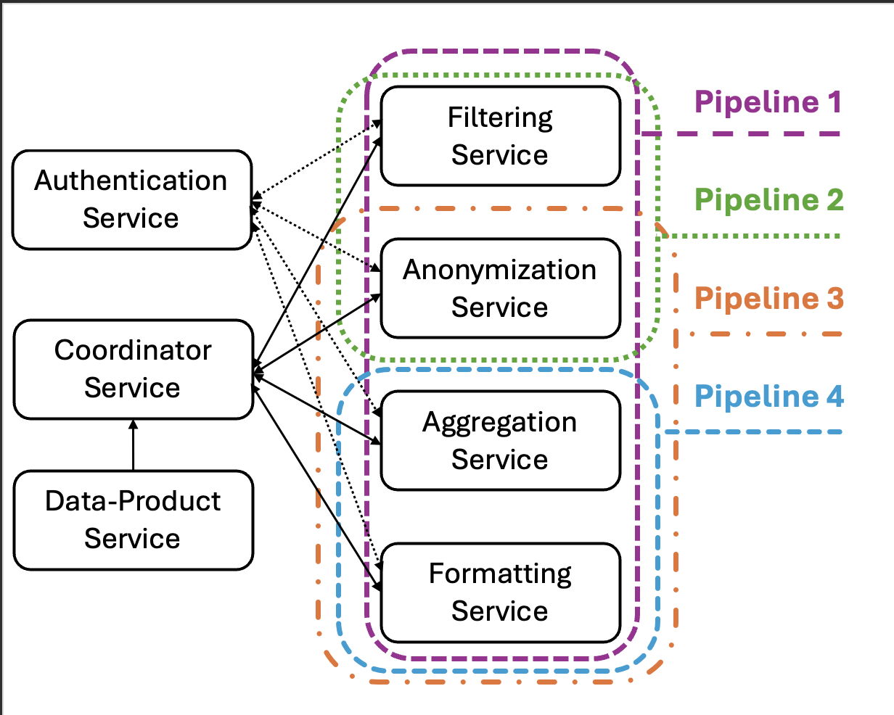

# 🛠️ Data-Sharing Pipelines

This repository provides a sample implementation of **data-sharing pipelines** built with **Java** using the **Spring Boot** framework.

## 📋 Overview

The project includes **four transformation services**, which can be combined dynamically to create different data-sharing pipelines. The configuration for these pipelines is defined using YAML files located in:
coordinator-service/src/main/resources/pipelines
These configuration files specify the order and type of transformations to be applied to shared data.
This project is deployable on the k8s and the required docker file for building the docker images is included in the main path of each service.

## 🧱 Architecture

The following image illustrates the overall architecture of the application and showcases the structure of some predefined pipelines described in the configuration files:

## ⚙️ Benchmarking Support

To facilitate benchmarking and evaluation, each transformation service provides **three different endpoints**:

| Endpoint Type | Description |
|---------------|-------------|
| `/normal`     | Executes the transformation in the normal flow. |
| `/flaky`      | Simulates a flaky service with a 50% failure rate. |
| `/delayed`    | Simulates a slow response by injecting a delay (configurable in `application.properties`). |

These features allow you to test and measure the performance and fault tolerance of various pipeline configurations.

## 🚀 Getting Started

To run the application:

1. Make sure you have **Java 17+** and **Maven** installed.
2. Clone the repository
3. Run each of the service by runing the /scr/*Application.java class under the main directory for each service.

📄 License

This project is released under the MIT License.

